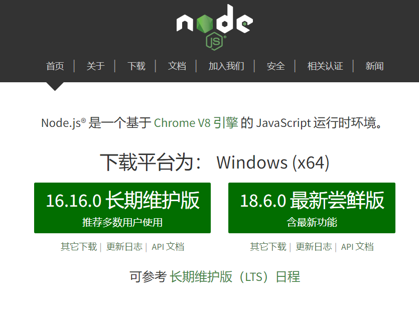
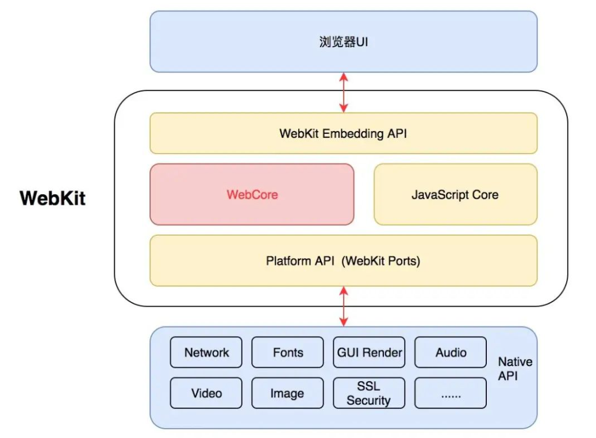
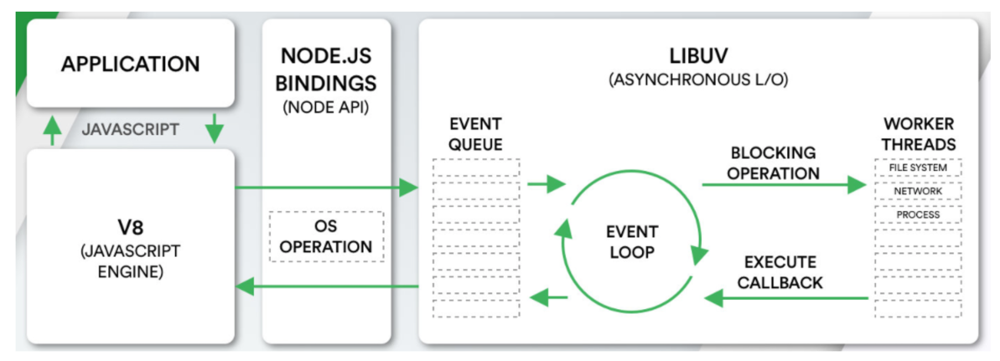
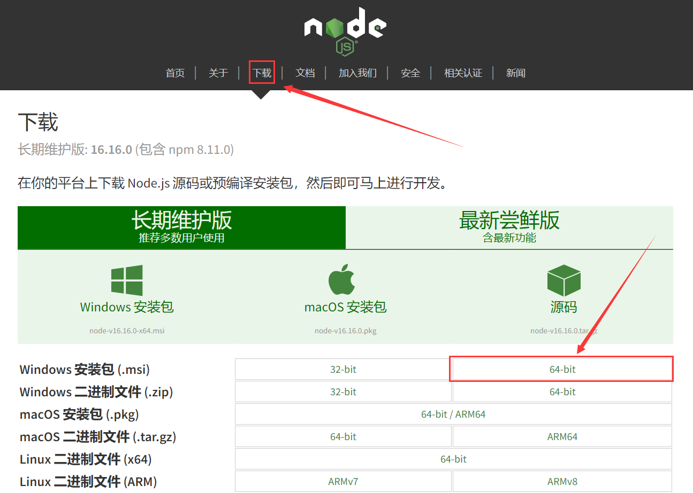

## 1. Node是什么

**官方对Node.js的定义：Node.js是一个基于V8 JavaScript引擎的JavaScript运行时环境。**



- 中文网：https://nodejs.org/zh-cn/
- Node.js基于V8引擎来执行JavaScript的代码
- 在Node.js中我们也需要进行一些额外的操作，比如文件系统读/写、网络IO、加密、压缩解压文件等操作
- 在Chrome浏览器中，还需要解析、渲染HTML、CSS等相关渲染引擎，另外还需要提供支持浏览器操作的API、浏览器自己的事件循环等



**Node的构架**
- 我们编写的JavaScript代码会经过V8引擎，再通过Node.js的Bindings，将任务放到Libuv的事件循环中；
- libuv（Unicorn Velociraptor—独角伶盗龙）是使用C语言编写的库；
- libuv提供了事件循环、文件系统读写、网络IO、线程池等等内容；



## 2. Node的应用场景

- Node.js的快速发展也让企业对Node.js技术越来越重视，在前端招聘中通常会对Node.js有一定的要求，特别对于高级前端开发工程师，Node.js更是必不可少的技能，总之一句话，Node是每一个前端程序员必须掌握的技能

**Node的应用场景**
- 前端开发的库都是以node包的形式进行管理，后面会学习大量的库
- npm、yarn工具成为前端开发使用最多的工具
- 使用Node.js作为web服务器开发、中间件、代理服务器
- 服务端渲染，借助Node.js完成前后端渲染的同构应用
- 使用Node可以编写一些脚本工具
- 使用Electron来开发桌面应用程序，是需要使用Node
- Node也可以开API接口

## 3. Node安装和管理

**Node.js是在2009年诞生的，目前最新的版本是分别是LTS 16.15.1以及Current 18.4.0**
- LTS版本：（Long-term support, 长期支持）相对稳定一些，推荐线上环境使用该版本，建议选择此版本
- Current版本：最新的Node版本，包含很多新特性

**最直接的安装方法**
- 直接下载对应的安装包下载安装
- window选择.msi安装包，Mac选择.pkg安装包
- 安装过程中会配置环境变量
- 会自动安装npm（Node Package Manager）工具



## 4. Node的版本工具

**可以在电脑上安装不同版本的Node，使用时，可以切换不同的版本。**
- nvm：Node Version Manager
- 通过 nvm install latest 安装最新的node版本
- 通过 nvm list 展示目前安装的所有版本
- 通过 nvm use 切换版本


## 4. Node环境中运行JS代码

**两个环境，可以运行JS代码**
- 浏览器
- node环境（可以通过终端命令node js文件的方式来载入和执行对应的js文件）

```js
// 02-node运行js文件.js  通过node命令就可以运行啦
console.log("hello node~");
console.log("hello node~");
console.log("hello node~");
console.log("hello node~");
```


安装vscode插件，code runner插件来，运行JS代码。


### 传递参数

**执行node程序的过程中，可以给node传递一些参数**
- node index.js env=development wangcai
- 在程序中通过process内置对象可以获取到传递的参数
- 在process内置对象的argv属性中存储着我们写的参数

```js
// 03-运行代码传递参数.js
let a = 110;
let b = 220;
console.log(a+b);

console.log(process.argv[2]);
console.log(process.argv[3]);
console.log(process.argv[4]);
```


## 5. Node的全局对象

**Node中给我们提供了一些全局对象，方便我们进行一些操作**
- 全局对象实际上是模块中的变量，只是每个模块都有，看来像是全局变量
- 包括：__dirname、__filename、exports、module、require()

**__dirname**
- 获取当前文件所在的路径，不包括后面的文件名

**__filename**
- 获取当前文件所在的路径和文件名称，包括后面的文件名称

**process对象**
- process提供了Node进程中相关的信息，如Node的运行环境、参数信息等

**console对象**
- 提供了简单的调试控制台，在前面讲解输入内容时已经学习过了

**定时器函数**
- setTimeout
- setInterval
- setImmediate，与setTimeout(callback, 0)是有区别的，在事件环阶段会讲
- process.nextTick，添加到下一次tick队列中

**process对象**
- process提供了Node进程中相关的信息，如Node的运行环境、参数信息等

```js

// D:\录课\20220606\17-工程化之node\code\01-node初识
// console.log(__dirname);

// D:\录课\20220606\17-工程化之node\code\01-node初识\05-全局对象.js
// console.log(__filename);

// process 是进程的意思
// process.argv 得到运行JS文件，传递的参数
// console.log(process.argv);

// 定时器
// console.log("start...");
// // Immediate 立即的意思   宏任务
// setImmediate(()=>{
//     console.log("setImmediate...");
// })
// console.log("end...");

console.log("start...");
setImmediate(()=>{
    console.log("setImmediate...");
})
// 微任务
process.nextTick(()=>{
    console.log("nextTick...");
})
console.log("end...");
```


## 6. global对象

**global是一个全局对象，事实上前面我们提到的process、console、setTimeout等都有被放到global中**
- 在新的标准中还有一个globalThis，也是指向全局对象的
- 类似于浏览器中的window
- 在浏览器中，全局变量都是在window上的，比如有document、setInterval、setTimeout、alert、console等
- 在Node中，我们也有一个global属性，并且看起来它里面有很多其他对象
- 浏览器中var声明的全局变量，会挂载到window上，node中var声明的变量，不会挂载到global上

```js
// 在浏览器环境中有一个window
// 在node环境中是没有window
// console.log(window);

// 在node环境有，也有一个全局对象，是global
// console.log(global);

// 为了统一，提出了一个叫globalThis关键字
// globalThis在node环境中代表global
// globalThis在浏览器环境中代表window

// console.log(globalThis === global); // true

var a = 110;
// 在node环境中定义的全局变量，并不会挂载到global上
console.log(global.a);
```

## 7. 内置模块path

**Linux和window上的路径时不一样的**
- window上会使用 \ 或者 \\ 来作为文件路径的分隔符，当然目前也支持 /
- Linux,Unix操作系统上使用 / 来作为文件路径的分隔符
- 如果我们在window上使用 \ 来作为分隔符开发了一个应用程序，要部署到Linux就可以出现问题 
- 为了屏蔽他们之间的差异，在开发中对于路径的操作我们可以使用 path 模块

**path模块用于对路径和文件进行处理，提供了很多方法**

**常见API**
- dirname：获取文件的父文件夹
- basename：获取文件名
- extname：获取文件扩展名
- path.join：路径的拼接
- path.resolve：把一个路径或路径片段的序列解析为一个绝对路径

## 二，MongoDB安装

### 2.1 安装MongoDB

1. 下载地址： https://www.mongodb.org/dl/win32
2. MongoDB版本号: 偶数为稳定版(推荐), 基数为开发版
3. MongoDB对32位操作系统支持不佳, 不推荐在32位系统上使用, 并且官方已经停更32位安装包


### 2.2 安装步骤

1. 全程下一步，修改安装路径
2. 配置环境变量, 将MongoDB的bin目录配置到系统变量Path中
3. 可以去服务列表中打开服务，相当于开始服务器。

### 2.3 连接服务器

通过mongo命令就可以连接服务器

1. mongo

## 三，快速上手MongoDB

### 3.1 连接MongoDB服务器

1. 通过mongo连接MongoDB服务器

### 3.2 查看数据库

**命令：** show dbs

### 3.3 创建数据库

**命令：**  use 数据库名称

* 和MySQL中的 use 指令一样, 只不过MongoDB中的use数据库不存在会自动创建
* 如：user person; 创建数据库  数据库名是person; 
* 如果没有向person数据库中插入集合，此时，这个数据库还是不存在的。

### 3.4 查看数据库中有哪些集合

**命令：**  show collections

* #和MySQL中的 show tables; 指令一样

### 3.5 创建集合

前面，使用use person，此时，db就表示person。

**命令：**   db.createCollection('集合名称'); 

* db.createCollection('users')
* 只要向person数据库中插入了集合，数据就才正式创建。

### 3.6 插入数据

**命令：**   db. 集合名称.insert(文档对象); 

* db.users.insert({name:"wc", age:100})
* 插入时，它会自动给每一个文档，添加一个_id，_id叫主键。

### 3.7 查询数据

**命令：**  db. 集合名称.find(); 

* db.users.find(); 

### 3.8 删除集合

**命令：**  db. 集合名称.drop()

* db.users.drop(); 
* 如果数据库中没有一个集合，那么数据库也不存在了

### 3.9 删除数据库

**命令：** db.dropDatabase()

* 在哪个数据库中就会删除哪个数据库

### 3.10 主键

**主键的作用：** 保证每一条数据唯一性的，MongoDB中的主键无需明确指定，每一个文档被添加到集合之后, MongoDB都会自动添加主键，MongoDB中文档主键的名称叫做 _id，默认情况下文档主键是一个ObjectId类型的数据，ObjectId类型是一个12个字节字符串(5e8c5ae9-c9d35e-759b-d6847d)，

* 4字节是存储这条数据的时间戳
* 3字节的存储这条数据的那台电脑的标识符
* 2字节的存储这条数据的MongoDB进程id
* 3字节是计数器
        

### 3.11 可视化工具

**下载地址：** https://www.mongodbmanager.com/

## 四，MongoDB-创建文档

### 4.1 写入一个文档

**命令一：** 

```js
db.users.insertOne({
    name: 'z3',
    age: 18
});
```

### 4.2 写入多个文档

```js
db.users.insertMany(
    [{
        name: 'zs',
        age: 18
    }, {
        name: 'ls',
        age: 19
    }, {
        name: 'ww',
        age: 20
    }], {}
)
db.person.find()
```

## 五，monogodb原⽣驱动

此次练习需要用到的依赖如下：

```json
"dependencies": {
    "express": "^4.17.3",
    "mongodb": "^4.4.0",
    "mongoose": "^6.2.4",
    "sequelize": "^6.17.0"
}
```

通过npm i直接安装上面的依赖。

### 5.1 连接数据库

```js
const MongoClient = require('mongodb').MongoClient

;
(async function() {
    const client = new MongoClient('mongodb://127.0.0.1:27017')
    // 链接服务端
    await client.connect()
    console.log('链接成功')

    // 获取数据库 
    const db = client.db('school')
    console.log("db:", db);
    // 获取集合
    const grade1 = db.collection('grade1')

    await grade1.insertOne({
        name: "张三3",
        age: 20,
        hobby: ['吃饭', '睡觉', '打豆豆'],
        score: 90
    })

    // 关闭客户端的链接
    client.close()
})()
```

### 5.2 插入多条数据

```js
const MongoClient = require('mongodb').MongoClient

;
(async function() {
    const client = new MongoClient('mongodb://127.0.0.1:27017')
    // 链接服务端
    await client.connect()
    console.log('链接成功')

    // 获取数据库 
    const db = client.db('school')
    // 获取集合
    const grade1 = db.collection('grade1')

    let r = await grade1.insertMany([{
            name: '张三',
            age: 20,
            hobby: ['吃饭', '睡觉', '打豆豆'],
            score: 90
        },
        {
            name: '李四',
            age: 40,
            hobby: ['妹子', '篮球'],
            score: 93
        },
        {
            name: '王五',
            age: 20,
            hobby: ['妹子', '睡觉'],
            score: 70
        },
        {
            name: '赵六',
            age: 16,
            hobby: ['妹子'],
            score: 50
        },
        {
            name: '张丽',
            age: 38,
            hobby: ['妹子'],
            score: 56
        },
        {
            name: '小红',
            age: 40,
            hobby: ['妹子'],
            score: 87
        },
        {
            name: '小马',
            age: 20,
            hobby: ['妹子'],
            score: 79
        },
        {
            name: '小王',
            age: 59,
            hobby: ['妹子'],
            score: 102
        },
        {
            name: '小黑',
            age: 16,
            hobby: ['妹子'],
            score: 60
        },
        {
            name: '小哥',
            age: 18,
            hobby: ['篮球'],
            score: 49
        },
    ])

    // 关闭客户端的链接
    client.close()
})()
```

### 5.3 查找某一条数据

```js
const MongoClient = require('mongodb').MongoClient

;
(async function() {
    const client = new MongoClient('mongodb://127.0.0.1:27017')
    // 链接服务端
    await client.connect()
    console.log('链接成功')

    // 获取数据库 
    const db = client.db('school')
    // 获取集合
    const grade1 = db.collection('grade1')

    r = await grade1.findOne({
        name: '张三'
    })
    console.log("r:", r);

    // 关闭客户端的链接
    client.close()
})()
```

### 5.4 查找多条数据

```js
const MongoClient = require('mongodb').MongoClient

;
(async function() {
    const client = new MongoClient('mongodb://127.0.0.1:27017')
    // 链接服务端
    await client.connect()
    console.log('链接成功')

    // 获取数据库 
    const db = client.db('school')
    // 获取集合
    const grade1 = db.collection('grade1')

    // 查找所有的数据
    // r = await grade1.find().toArray()
    // console.log("r:", r);

    r = await grade1.find({
        name: '张三'
    }).toArray()
    console.log("r:", r);

    // 关闭客户端的链接
    client.close()
})()
```

### 5.5 比较运算符

```js
const MongoClient = require('mongodb').MongoClient

;
(async function() {
    const client = new MongoClient('mongodb://127.0.0.1:27017')
    // 链接服务端
    await client.connect()
    console.log('链接成功')

    // 获取数据库 
    const db = client.db('school')
    // 获取集合
    const grade1 = db.collection('grade1')

    // 比较运算符
    r = await grade1.find({
        age: {
            // gt大于 lt小于  gte 大于等于  lte小于等于
            $gte: 20,
        },
    }).toArray()
    console.log("r:", r);

    // 关闭客户端的链接
    client.close()
})()
```

### 5.6 逻辑运算符

```js
const MongoClient = require('mongodb').MongoClient

;
(async function() {
    const client = new MongoClient('mongodb://127.0.0.1:27017')
    // 链接服务端
    await client.connect()
    console.log('链接成功')

    // 获取数据库 
    const db = client.db('school')
    // 获取集合
    const grade1 = db.collection('grade1')

    // 逻辑运算符  $and  $or $ne  $nor 不等于
    // 查询姓名叫王五并且年龄为20岁的人
    // r = await grade1.find({
    //     name: '王五',
    //     age: 20,
    // }).toArray()
    // console.log("r:", r);

    // -----------------------------

    // 查询姓名叫张三或者年龄为20岁的人
    // r = await grade1.find({
    //     $or: [
    //         {
    //             name: '张三',
    //         },
    //         {
    //             age: 20,
    //         },
    //     ],
    // }).toArray()
    // console.log("r:", r);

    // -----------------------------

    // // 查询年龄不大于20岁并且age不小于16的人员
    r = await grade1.find({
        $nor: [{
                age: {
                    $gt: 20,
                },
            },
            {
                age: {
                    $lt: 16,
                },
            },
        ],
    }).toArray()

    console.log("r:", r);

    // 关闭客户端的链接
    client.close()
})()
```

### 5.7 指定正则

```js
const MongoClient = require('mongodb').MongoClient

;
(async function() {
    const client = new MongoClient('mongodb://127.0.0.1:27017')
    // 链接服务端
    await client.connect()
    console.log('链接成功')

    // 获取数据库 
    const db = client.db('school')
    // 获取集合
    const grade1 = db.collection('grade1')

    // 正则表达式
    r = await grade1.find({
        name: {
            $regex: /^张/,
        },
    }).toArray()

    console.log("r:", r);

    // 关闭客户端的链接
    client.close()
})()
```

### 5.8 $all $in $size

```js
const MongoClient = require('mongodb').MongoClient

;
(async function() {
    const client = new MongoClient('mongodb://127.0.0.1:27017')
    // 链接服务端
    await client.connect()
    console.log('链接成功')

    // 获取数据库 
    const db = client.db('school')
    // 获取集合
    const grade1 = db.collection('grade1')

    // $all $in $size

    // 查找指定字段包含所有指定内容的数据
    // r = await grade1.find({
    //     hobby: {
    //         $all: ['妹子'],
    //     },
    // }).toArray()
    // console.log("r:", r);

    // ----------------------------------

    // 查找指定字段只有指定内容其一的数据
    // r = await grade1.find({
    //     hobby: {
    //         $in: ['妹子', '睡觉'],
    //     },
    // }).toArray()

    // console.log("r:", r);

    // ----------------------------------

    // 查找指定字段的数据有三条的
    r = await grade1.find({
        hobby: {
            $size: 3,
        },
    }).toArray()
    console.log("r:", r);

    // 关闭客户端的链接
    client.close()
})()
```

### 5.9 分页

```js
const MongoClient = require('mongodb').MongoClient

;
(async function() {
    const client = new MongoClient('mongodb://127.0.0.1:27017')
    // 链接服务端
    await client.connect()
    console.log('链接成功')

    // 获取数据库 
    const db = client.db('school')
    // 获取集合
    const grade1 = db.collection('grade1')

    // 分页查询  limit()
    // 查询前两条数据
    // r = await grade1.find().limit(2).toArray()
    // console.log("r:", r);

    // --------------------------------

    // 跳过前2条数据,获取后4条数据
    // r = await grade1.find().skip(2).limit(4).toArray()
    // console.log("r:", r);

    // --------------------------------

    // 根据age字段进行排序 1表示正序  -1 表示倒序
    // r = await grade1.find().sort({
    //     age: -1,
    // }).toArray()
    // console.log("r:", r);

    // --------------------------------

    // 分页
    const pageIndex = 1 //当前的索引
    const pageSize = 3 //当前一页显示的数据
    r = await grade1
        .find()
        .skip((pageIndex - 1) * pageSize)
        .limit(pageSize)
        .toArray()
    console.log("r:", r);

    // 关闭客户端的链接
    client.close()
})()
```

### 5.10 聚合函数

```js
const MongoClient = require('mongodb').MongoClient

;
(async function() {
    const client = new MongoClient('mongodb://127.0.0.1:27017')
    // 链接服务端
    await client.connect()
    console.log('链接成功')

    // 获取数据库 
    const db = client.db('school')
    // 获取集合
    const grade1 = db.collection('grade1')

    // 聚合函数 $sum $min $max $avg

    // 相同年龄的人数
    // r = await grade1.aggregate([
    //     {
    //         $group: {
    //             _id: '$age',
    //             count: {
    //                 $sum: 1,
    //             },
    //         },
    //     },
    // ]).toArray()
    // console.log("r:", r);

    // --------------------------------

    // r = await grade1.aggregate([
    //     {
    //         $group: {
    //             _id: '$age',
    //             avgScore: {
    //                 $avg: '$score',
    //             },
    //         },
    //     },
    // ]).toArray()
    // console.log("r:", r);

    // --------------------------------

    r = await grade1.aggregate([{
        $group: {
            _id: '$age',
            avgScore: {
                $max: '$score',
            },
        },
    }, ]).toArray()

    console.log("r:", r);

    // 关闭客户端的链接
    client.close()
})()
```

### 5.11 更新文档

```js
const MongoClient = require('mongodb').MongoClient

;
(async function() {
    const client = new MongoClient('mongodb://127.0.0.1:27017')
    // 链接服务端
    await client.connect()
    console.log('链接成功')

    // 获取数据库 
    const db = client.db('school')
    // 获取集合
    const grade1 = db.collection('grade1')

    r = await grade1.updateOne({
        name: "张三",
    }, {
        $set: {
            name: "小张三"
        }
    })
    console.log('更新成功', r)

    // 关闭客户端的链接
    client.close()
})()
```

### 5.12 删除文档

```js
const MongoClient = require('mongodb').MongoClient

;
(async function() {
    const client = new MongoClient('mongodb://127.0.0.1:27017')
    // 链接服务端
    await client.connect()
    console.log('链接成功')

    // 获取数据库 
    const db = client.db('school')
    // 获取集合
    const grade1 = db.collection('grade1')

    // 当你做删除的时候 一定要问一下自己 是否要删除
    r = await grade1.deleteOne({
        name: '张三'
    })
    console.log(r.result);

    // 关闭客户端的链接
    client.close()
})()
```

### 5.13 班级学生管理

如下内容直接copy使用：


```js
// dbConfig.js
module.exports = {
    url: 'mongodb://127.0.0.1:27017',
    dbName: 'classes',
}
```

```js
// testData.js
const mongodb = require('./index.js');
mongodb.once('connect', async () => {
    const students = mongodb.col('students');
    try {
        // 插入测试数据
        await students.deleteMany();
        await students.insertMany([{
                "name": '张三',
                "age": 20,
                "score": 90,
                "class": 1
            },
            {
                "name": '李四',
                "age": 24,
                "score": 90,
                "class": 4
            },
            {
                "name": '王五',
                "age": 28,
                "score": 95,
                "class": 2
            },
            {
                "name": '张三',
                "age": 20,
                "score": 93,
                "class": 1
            },
            {
                "name": '张三2',
                "age": 40,
                "score": 40,
                "class": 1
            },
            {
                "name": '张三3',
                "age": 20,
                "score": 90,
                "class": 1
            },
            {
                "name": '张三4',
                "age": 20,
                "score": 90,
                "class": 1
            },
            {
                "name": '张三6',
                "age": 20,
                "score": 90,
                "class": 1
            },
            {
                "name": '张三7',
                "age": 20,
                "score": 90,
                "class": 1
            },
            {
                "name": '张三',
                "age": 20,
                "score": 90,
                "class": 1
            }
        ])
        console.log('测试数据插入成功');

    } catch (error) {
        console.log(error.stack);

    }
})
```

```js
// index.js
const dbConfig = require('./dbConfig')
const MongoClient = require('mongodb').MongoClient
const EventEmitter = require('events')
class Mongo {
    constructor(dbConfig) {
        this.dbConfig = dbConfig
        this.emitter = new EventEmitter()
        // 创建客户端
        this.client = new MongoClient(this.dbConfig.url)
        // 建立连接
        this.client.connect((err) => {
            if (err) throw err
            console.log('连接数据库成功')
            this.emitter.emit('connect')
        })
    }
    once(eventName, cb) {
        //   只会连接一次
        this.emitter.once(eventName, cb)
    }
    //   获取集合的方法
    col(colName, dbName = this.dbConfig.dbName) {
        return this.client.db(dbName).collection(colName)
    }
}
module.exports = new Mongo(dbConfig)
```

```js
// 班级学生管理.js
const express = require('express');
const app = express();
const path = require('path');
const mongod = require('./db')
const testData = require('./db/testData')
const ObjectId = require('mongodb').ObjectId;
app.use(express.urlencoded({
    extended: true
})); //x-www-urlencoded

app.get('/', (req, res) => {
    // 做重定向路由
    res.redirect('/classes')
})
app.get('/classes', (req, res) => {
    res.sendFile(path.resolve(__dirname + '/classes.html'))
})

// 定义所有班级内容的接口
app.get('/api/classList', async (req, res) => {
    let {
        pageSize,
        pageIndex
    } = req.query;
    pageSize = Number(pageSize)
    pageIndex = Number(pageIndex)
    // console.log(pageSize,pageIndex);
    // http://localhost:3000/api/classList?pageSize=4&pageIndex=2
    // 链接数据库 
    // 获取集合对象 
    const students = mongod.col('students');
    const total = await students.countDocuments();
    // 调用find()获取所有的数据 
    const classList = await students.find().skip((pageIndex - 1) * pageSize).limit(pageSize).toArray();
    res.json({
        ok: 1,
        data: classList,
        total
    })
})

// 删除 post请求
app.post('/api/deleteUser', (req, res, next) => {
    next()
}, async (req, res) => {
    const {
        _id
    } = req.body;
    console.log(_id)
    const students = mongod.col('students');
    const r = await students.deleteOne({
        _id: ObjectId(_id)
    })
    if (r.deletedCount === 1) {
        res.json({
            ok: 1,
            msg: '删除数据成功'
        })
    }
})

app.listen(3000, () => {
    console.log('3000端口 被监听了');
})
```

浏览器中测试如下：  <br />


#### 运行项目

1. node app.js
2. 将博客接口导入到 `postMan` 中
3. 安装好 `MongoDB` 和可视化工具之后，可以直接调用接口，数据库会自动创建